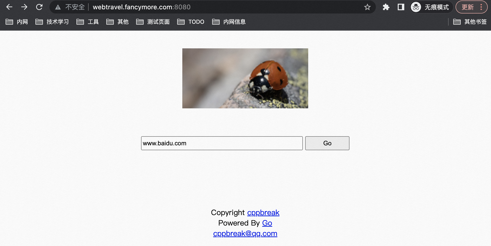
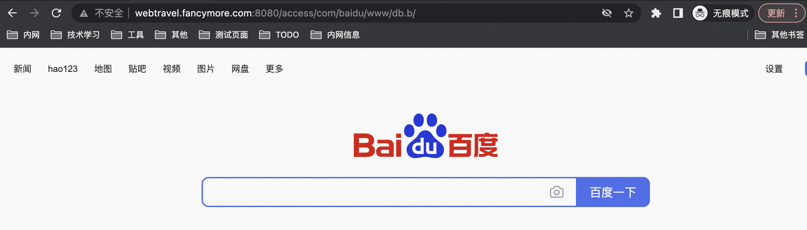

# 简介

VPN(虚拟专用网络)利用加密通信，在公共网络上建立专用网络的技术，外部网络通过加密认证，访问内网数据。SSL VPN 是解决远程用户访问敏感公司数据最简单最安全的解决技术。利用浏览器内置 SSL 协议，无需安装客户端，便可从外网访问内网应用。

webtravel 实现通过 SSL 协议访问后端服务的代理技术。其原理如下：

* 客户端浏览器通过访问代理地址 `https://proxy.com/baidu.com`
* 服务器收到 /baidu.com 的请求时，访问 `baidu.com`，把返回的html数据返回给客户端。
* 从baidu.com返回的html数据包含很多图片，css，js信息，如 `http://www.baidu.com/img/bdlogo.gif`，如果把html不加更改的返回客户端，浏览器就会从`baidu.com/img/bdlogo.gif`获取图片，撇开了 proxy.com，所以服务器端必须修改html，把其中的链接改为 `https://proxy.com/baidu.com/img/bdlogo.gif`。

其中除了html中的链接，还包括js，css中的链接，以及客户端js拼接的地址。当然，其中还需要修改http头中的cookie、referer等信息。webtravel 实现了重要逻辑的修改，可访问twitter，webqq等复杂应用。

# 编译运行

下载代码和编译

```
git clone git@github.com:drawing/webtravel.git

cd webtravel
go build
```

配置修改 `config/site.json`

```
{
        "Protocol" : "http",
        "Domain" : "webtravel.fancymore.com",
        "AccessPath" : "/access/",
        "AccessAddress" : "webtravel.fancymore.com:8080",

        "ListenAddress" : "0.0.0.0:8080"
}
```

* `Domain` 当前程序的域名
* `AccessAddress` 当前运行的域名:端口，如监听80端口，可不写端口
* `ListenAddress` 当前运行程序监听的 IP 和端口


执行程序
```
./webtravel -config ./config/site.json
```

# 使用

打开首页



输入期望访问的地址，如 `www.baidu.com`，点 `Go`，跳转到目标页面



此页面虽然为百度首页，但完全通过 `webtravel` 程序中转，并未直接访问百度资源。
